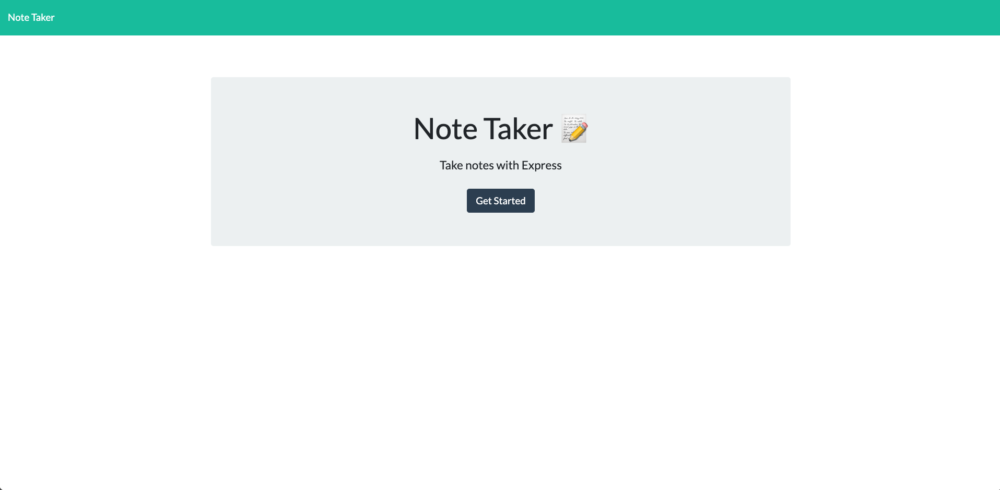

# 11 Express.js: Note Taker

# Badge: 

# Table of Contents

1. [Description](#description)
2. [Technologies Used](#technologies-used)
3. [Installation](#installation)
4. [Usage](#usage)
5. [Contributions](#contribution)
6. [License](#license)
7. [Testing Instructions](#testing-instructions)
8. [Questions](#questions)

# Description

This application is used to create a streamlined and robust README for your project.

# Technologies Used

HTML
CSS
JavaScript
Node.JS
Express.JS
UUID
Heroku

# Installation

NPM i
NPM i express
NPM i uuid

# Usage

You will access the main screen of the Note Taker App

# Contributions

None

# License

This project is licensed under MIT

# Testing Instructions

I tested this project using Node.JS, Insomnia, and Heroku

# Questions

1. My Github Profile: https://github.com/kjackson206
2. This Project: https://kjackson206.github.io/note-taker/
3. Heroku App: https://kj-note-taker.herokuapp.com/
4. My Email: katherine.jackson206@gmail.com
